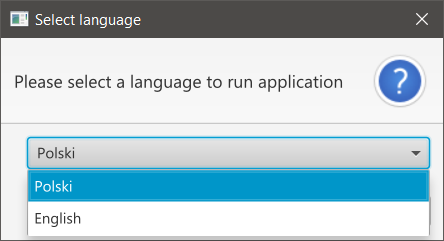
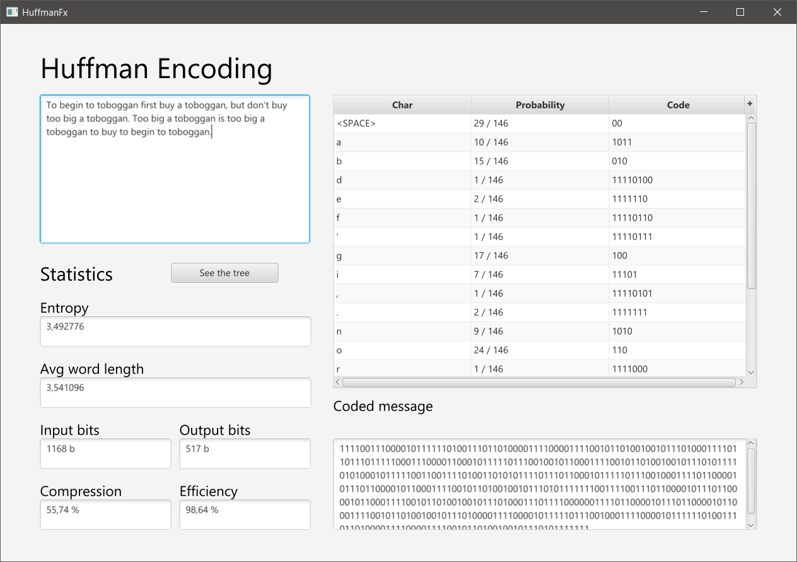
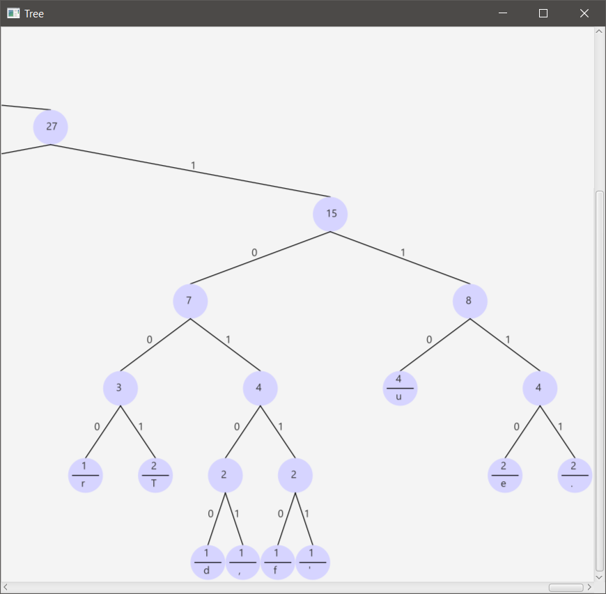

# huffmanAlghoritmFx

### RUN 
  mvn clean javafx:run

### DEPLOY
  mvn clean javafx:jlink

### Path to the prepared application
 target/huffman

### Zipped application path 
  target/huffman.zip

### Run application
* [WINDOWS] huffman/bin/launch.sh.bat
* [LINUX] huffman/bin/launch.sh

### Application screenshot

